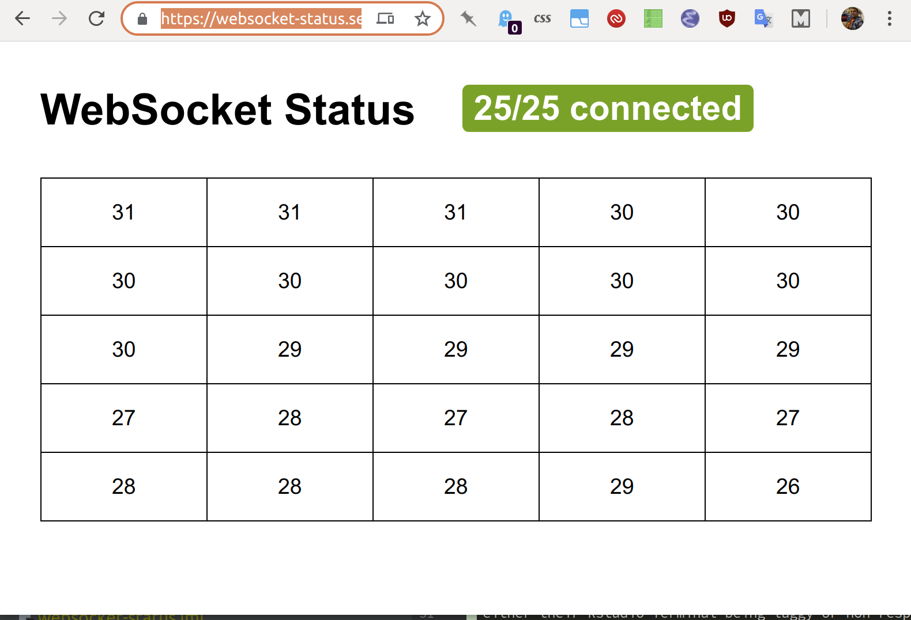

# Web Socket Status Page

A quick and dirty tool for checking websockets work

Due to strange network configurations we sometimes see users who can't use
jupyter or rstudio/shiny-apps. This is usually because of a problem with their
network setup. This is a service we can deploy and point their IT helpdesk to so
they can see the problem (because they can't login to the platform)

This will set up a server that sends the current time to any connected websockets
once a second and a webpage that will try to connect 25 websockets to that server.
The page will display the number of connected sockets and will tell you when all 25
are connected successfully.

## Installation and running locally

- create a virtualenv
- `pip install -r requirements.txt`
- `DEBUG=1 python server.py`

It will listen on port 8000.

## Running in docker

- `docker build . -t websocket-status`
- `docker run --rm -it -p 8000:8000 websocket-status`

# When to use this?

## RStudio

If you are getting reports about a user on a corporate network having trouble with
either their RStudio Terminal being laggy or non-responsive it's worth asking them
to visit the websocket status page. Usually hosted at https://websocket-status.services.alpha.mojanalytics.xyz/
and see if they end up with "25/25 connected"

## Jupyter

If you are seeing reports of users not being able to execute cells in Jupyter it's
also worth getting them to visit the websocket status tool.

A symptom of broken websockets is the kernel indicator (the circle next to the Python
version in the above image) being black or grey.

# License
[MIT](./LICENSE)
